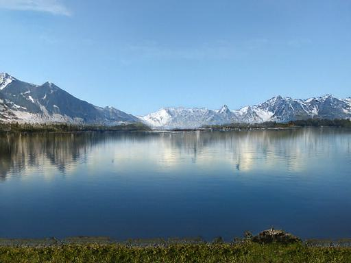
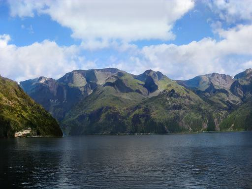

# Jittor 第二届计图人工智能挑战赛 热身赛方案
我和我的两个可爱师叔战队在第二届计图（jittor）人工智能挑战赛-风景图像生成赛道的方案。


## 简介

本项目包含了第二届计图挑战赛计图 - 风景图像生成赛道方案的代码实现。主要方法基于CoCosNet。 

<figure>



<center style="font-size:14px;color:#C0C0C0;text-decoration:underline">图1.生成的样例图像</center> 
</figure>
## 安装 

本项目可在 1 张 RTX 3090 上训练及测试。

#### 运行环境
- ubuntu 20.04 LTS
- python >= 3.7
- jittor >= 1.3.0

#### 安装依赖
执行以下命令安装本项目使用的依赖环境。
```
pip install -r requirements.txt
```

#### 预训练模型
预训练模型可以从[百度网盘](https://pan.baidu.com/s/1fW-kj4wW6K4vAoQ1qXzPZA?pwd=2ouv)下载。
下载后解压并放在当前目录即可。


## 训练

训练数据集可以从[这里](https://cloud.tsinghua.edu.cn/f/1d734cbb68b545d6bdf2/?dl=1)下载。

模型的训练可以参考以下命令：

```
python train.py --input_path [训练集路径]
```                    

## 测试

测试数据集可以从[这里](https://cloud.tsinghua.edu.cn/f/980d8204f38e4dfebbc8/?dl=1)下载。

本方法是基于参考图像的图像生成，因此测试时需要使用我们指定的参考图像，这些图像是从训练集挑选出的。
这些参考图像可以从[百度网盘](https://pan.baidu.com/share/init?surl=QqUV49nhebYC5EV8Iync9w&pwd=2v0q)下载，解压后放在当前目录的ref_imgs文件夹下即可。

使用我们提供的预训练模型和参考图像进行测试可以参考以下命令：
```
python train.py --input_path [测试集路径] --output_path ./results
```             
生成的参考图像将保存在当前目录下的results文件夹中。

## 致谢

此项目基于论文 *Cross-domain Correspondence Learning for Exemplar-based Image Translation* 实现，部分代码参考了 [CoCosNet](https://github.com/microsoft/CoCosNet)。
